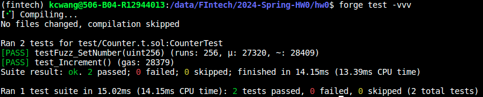
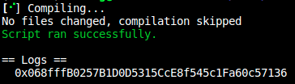
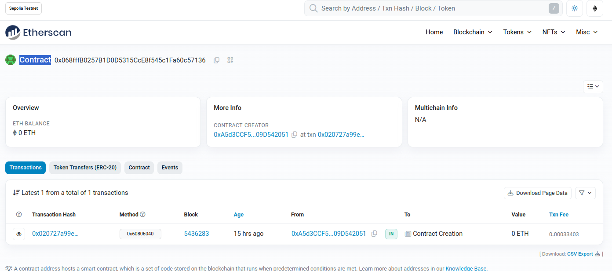

# 2024-Spring-HW0

All the detailed specified in Homework 0 documentation.

## Wallet Address
Please provide your MetaMask wallet address:
```
0xA5d3CCF557E1a887fdCAAE0A53025F909D542051
```

## Local Testing
Please provide a screenshot of the `forge test -vvv` command running in your local environment.



And, this is the screenshot of the deployment.



## Contract Address
Please provide the contract address that you deployed on the Sepolia network. 
```
0x068fffb0257b1d0d5315cce8f545c1fa60c57136 
```


## Sepolia Etherscan
Paste the contract address into the Sepolia Etherscan and share the screenshot.
